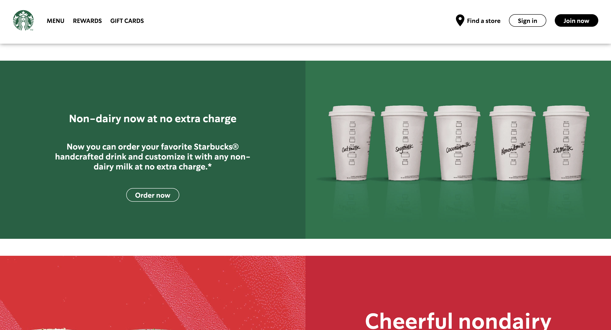
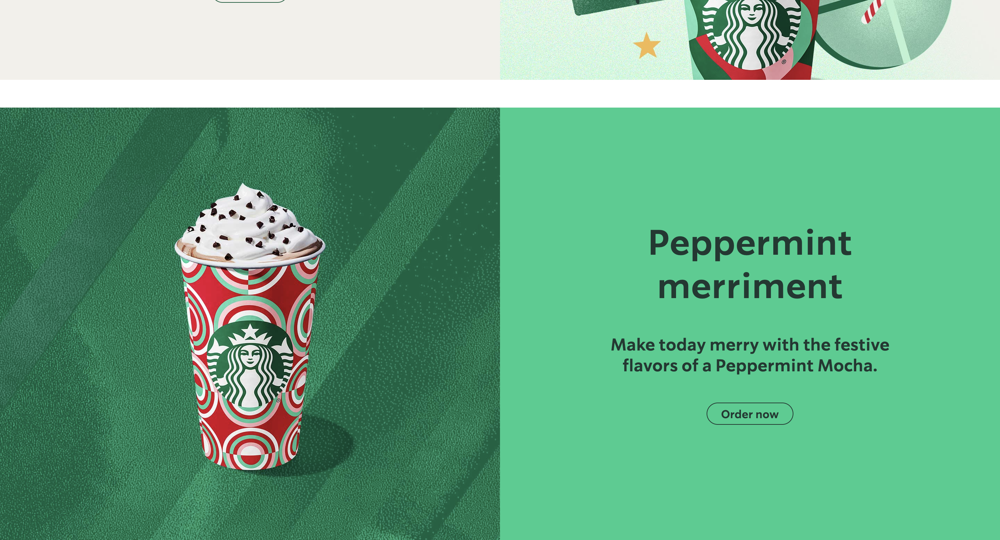
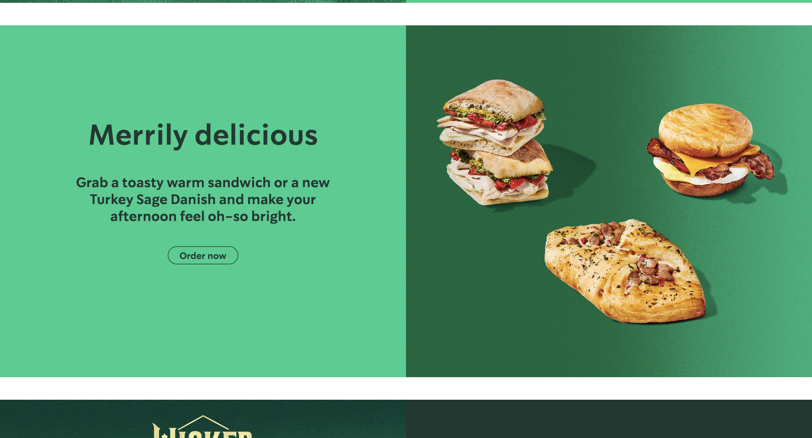
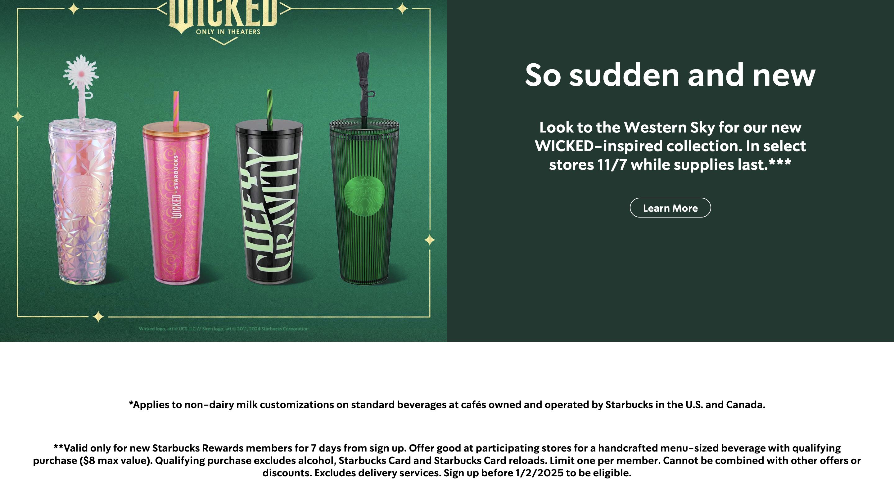

# STARBUCKS HOMEPAGE DESIGN

This project is an HTML and CSS design of the Starbucks homepage. It was created to improve web development skills and learn responsive design techniques.

## 🖼️ Project Screenshots

## 🚀 Features
* Modern, semantic structure using HTML5.
* Visually rich design using CSS3.
* Responsive Design: Compatible with mobile, tablet, and desktop devices.
* Starbucks brand's color palette and styling guide.

## 🎨 Technologies Used
* HTML5
* CSS3

## 💡 What I Learned
Key lessons learned from this project:

* Creating responsive designs with HTML and CSS.
* Designing according to a real brand's style.
* Using Flexbox layouts.

## 📬 Contact
If you have any questions about this project, feel free to reach out:

Email: mert10temizer@gmail.com

GitHub: github.com/MertTemizer

